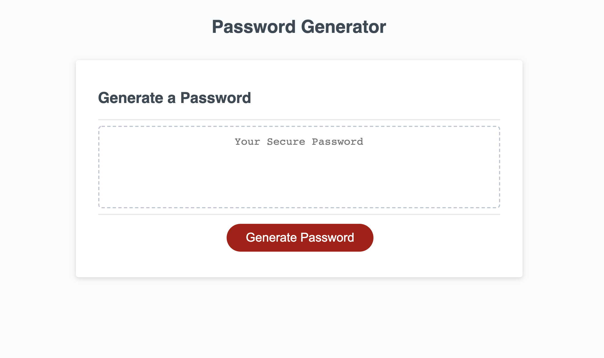

# Homework-03-PasswordGen
## Homework 3 Password Generator

# <BTCMP Homework 3>
## Description
This javascript will randomly generate a password for you... But you must remember that there is no such thing as random for computers.
## Installation
You do not need anything special to run this functioning code. 
Link for deployed repo: https://gannacon.github.io/Homework-03-PasswordGen/
## Assets
Below is a screenshot of the home page.

 

## Credits
I give credit to Byron and Chris who helped me understand HTML and CSS. This code was from scratch but they were a valuable resource when completing this assignment.

## My Task

This week’s homework requires you to modify starter code to create an application that enables employees to generate random passwords based on criteria that they’ve selected. This app will run in the browser and will feature dynamically updated HTML and CSS powered by JavaScript code that you write. It will have a clean and polished, responsive user interface that adapts to multiple screen sizes.

The password can include special characters. If you’re unfamiliar with these, see this [list of password special characters](https://www.owasp.org/index.php/Password_special_characters) from the OWASP Foundation.

## User Story

```
AS AN employee with access to sensitive data
I WANT to randomly generate a password that meets certain criteria
SO THAT I can create a strong password that provides greater security
```

## Acceptance Criteria

```
GIVEN I need a new, secure password
WHEN I click the button to generate a password
THEN I am presented with a series of prompts for password criteria
WHEN prompted for password criteria
THEN I select which criteria to include in the password
WHEN prompted for the length of the password
THEN I choose a length of at least 8 characters and no more than 128 characters
WHEN prompted for character types to include in the password
THEN I choose lowercase, uppercase, numeric, and/or special characters
WHEN I answer each prompt
THEN my input should be validated and at least one character type should be selected
WHEN all prompts are answered
THEN a password is generated that matches the selected criteria
WHEN the password is generated
THEN the password is either displayed in an alert or written to the page
```
